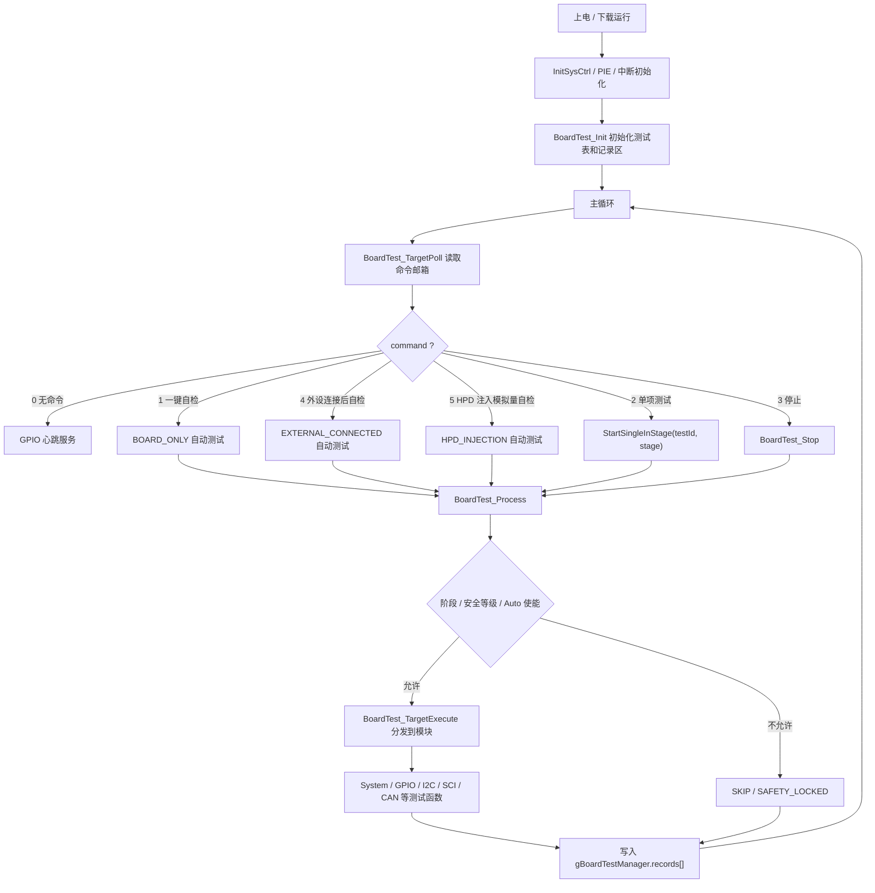

# DSP1 下位机测试软件设计方案大纲

更新时间：2026-06-29

## 1. 当前目标

在 `Lab14_Example_2837xD_IIC_liushui` 内开发 F28377D DSP1 下位机测试程序，用于后续上位机触发三类测试：一键板载自检、外设连接后自检、HPD 注入模拟量自检，并逐步接入 HPD 模组例行试验大纲中的软件模拟项和真实 ADC 采样项。

当前阶段只做 DSP1，不处理 DSP2 和 FPGA 侧逻辑。

## 2. 自检结论

| 检查项 | 当前结果 |
|---|---|
| Git 仓库 | 已建立，分支 `main` |
| GitHub 远端 | 已建立，private 仓库：`https://github.com/zhouyinqi/Lab14_Example_2837xD_IIC_liushui` |
| 工作区 | 有本轮阶段模型开发变更，未提交；`Debug/`、`Release/` 仍为忽略的编译输出 |
| Host 单元测试 | 通过 |
| Debug Flash 编译 | 通过 |
| Release Flash 编译 | 通过 |
| 源码一致性 | 当前代码已通过测试和编译；Git 提交需等你确认是否纳入本地入口文件变更 |

结论：当前代码层面无编译错误；板级硬件结果仍以你下载到板子后的测试为准。

## 3. 文件夹分层

```text
Lab14_Example_2837xD_IIC_liushui/
├─ .ccsproject/.cproject/.project     CCS 工程配置
├─ .settings/                         CCS/Eclipse 本地配置
├─ .launches/                         CCS 调试启动配置
├─ CMD/                               链接脚本
│  ├─ 2837x_FLASH_lnk_cpu1.cmd        当前 Flash 编译使用
│  ├─ 2837xD_RAM_lnk_cpu1.cmd         旧 RAM 链接脚本，保留参考
│  └─ F2837x_Headers_nonBIOS_cpu1.cmd 外设寄存器映射
├─ Source/                            下位机源码
│  ├─ main.c                          main 入口，初始化系统并轮询测试框架
│  ├─ Board_Test.c                    测试项表、状态机、自动/单项执行逻辑
│  ├─ Board_Test_Target.c             CCS 命令邮箱和测试分发
│  ├─ Board_System_Test.c             时钟、Timer、Watchdog、RAM、Flash 自检
│  ├─ Board_Gpio_Test.c               LED/GPIO 心跳和读回测试
│  ├─ Board_I2c_Test.c                I2C-B TMP116 测试
│  ├─ Board_Sci_Test.c                SCI 内部回环测试框架
│  ├─ Board_Can_Test.c                CAN-B 内部回环测试
│  ├─ User_Iic_Led.c                  原 Lab14 I2C RTC/流水灯逻辑
│  └─ F2837xD_*.c/F28x_*.c            TI 设备支持文件
├─ include/                           头文件
│  ├─ Board_Test.h                    测试 ID、结果码、记录结构
│  ├─ Board_Test_Target.h             命令邮箱接口
│  ├─ Board_Pinmap.h                  DSP1 已确认管脚表
│  ├─ Board_*_Test.h                  各测试模块接口
│  ├─ Hpd_Test_Limits.h               HPD 例行试验限值/模拟目标值
│  └─ F2837xD_*.h                     TI 设备头文件
├─ Tests/                             PC 侧 host 单元测试
│  ├─ run_host_tests.ps1              一键运行 host 测试
│  └─ test_board_test.c.host          框架逻辑单元测试
├─ Lib/                               TI 运行库
├─ Debug/                             CCS 生成输出，Git 忽略
├─ Release/                           CCS 生成输出，Git 忽略
└─ *.md/*.txt/*.docx/*.pdf            说明文档、计划、资料
```

## 4. 当前测试框架流程



## 5. 已完成内容

| 模块 | 测试项 | 状态 | 说明 |
|---|---|---|---|
| Git/工程管理 | 本地仓库 + GitHub private 远端 | 已完成 | `main` 分支已建立 |
| Flash 工程 | Debug/Release Flash 链接 | 已完成 | 默认下载 Debug `.out` 调试 |
| 框架 | 测试表、记录区、阶段自动/单项执行 | 已完成 | 已拆成 BOARD_ONLY、EXTERNAL_CONNECTED、HPD_INJECTION |
| 命令接口 | `gBoardTestCommandMailbox` | 已完成 | 支持三类按钮、单项测试、HPD 输入源和模拟物理量 |
| 基础自检 | SYS_STARTUP/CLOCK/TIMER/WATCHDOG/RAM/FLASH | 已完成 | 已可自动执行 |
| GPIO | LED 心跳/读回 | 已完成 | 流水灯已板上验证 |
| I2C-A RTC | 原 Lab14 RTC/流水灯逻辑接入 | 已完成 | 你之前截图显示通过 |
| I2C-B TMP116 | 器件 ID/温度读取 | 已开发 | 待板上最终确认 |
| SCI | 内部回环框架 | 已开发 | SCIB Lab07 版本暂不采用 |
| CAN-B | 内部回环收发 | 已完成 | 已板上验证通过；外部 USB-CAN 后续单独做 |
| HPD 限值 | 例行试验模拟目标值 | 已建立 | 只建立限值头文件，未实现测试执行 |
| Host 测试 | 框架逻辑测试 | 已完成 | 当前通过 |

## 6. 待开发 / 未开发清单

| 优先级 | 模块 | 当前状态 | 下一步 |
|---|---|---|---|
| P0 | 外部 CAN | 未实现 | 使用 USB-CAN，作为外设连接后自检项目 |
| P0 | SPI-A/B/C | 未实现 | 做基础收发/外设识别，需确认外部器件 |
| P0 | ADC 基础 | 未实现 | 先做通道采样框架和软件模拟，再接真实注入 |
| P0 | PWM 基础 | 未实现 | 先低风险配置检查，不打开高功率输出 |
| P1 | EMIF | 未实现 | 先只做总线配置/只读识别，避免误写外部器件 |
| P1 | Ethernet/W5300 | 未实现 | 按 DSP1 可完全控制设计，暂不考虑 DSP2 |
| P1 | 上位机协议 | 未实现 | 将 CCS 命令邮箱替换为 SCI/CAN/USB 等协议层 |
| P1 | 结果导出 | 未实现 | 统一结果码、测试 ID、测量值、上下限 |
| P2 | HPD 软件模拟 | 未实现 | 先模拟 NTC、母线、电流、相序等可软件生成的值 |
| P2 | HPD 试验台实测 | 未实现 | 需要接线、传感器、功率安全条件后再启用 |
| P2 | 安全授权 | 未实现 | 高功率项必须加软件授权和默认锁定 |

## 7. HPD 试验接入原则

```text
按钮 1：一键自检 / BOARD_ONLY
- 不接外部线，只测板载和内部回环项目。
- CAN-B 使用内部静默回环，不要求接 CAN 口。

按钮 2：外设连接后自检 / EXTERNAL_CONNECTED
- 执行前由上位机提示接线。
- 范围包括 USB-CAN、Ethernet/W5300、SPI 外设、外部 I2C、RS485/SCI。
- 单项测试功能保留，用于连接外设后的逐项调试。

按钮 3：HPD 注入模拟量自检 / HPD_INJECTION
- 上位机下发可手动修改的物理量，例如母线电压、线电压、频率、电流、温度。
- 软件模拟模式：物理量 -> ADC raw -> 物理量换算 -> 限值判定。
- 真实 ADC 模式：真实 ADC raw -> 物理量换算 -> 限值判定，模拟输入值不再作为测量值。
- 高功率发波和试验台输出默认锁定，后续必须加授权和安全前置条件。
```

## 8. 未来开发路线


## 9. 当前推荐下一步

下一步建议优先开发 HPD 注入模拟量框架：先让上位机/CCS 能写入 60V、200A、25℃ 等物理量，再由下位机换算成 ADC raw 并走统一限值判定。之后再接真实 ADC 采样。

CAN-B 单项验证方式：

```text
gBoardTestCommandMailbox.testId = 0x0300
gBoardTestCommandMailbox.command = 2

期望：
- gBoardTestManager.records[10].result = 2
- gBoardTestManager.records[10].errorCode = 0
- gBoardCanLoopbackSnapshot.statusMask 至少包含 0x000D
- txLow/rxLow、txHigh/rxHigh 数据一致
```
